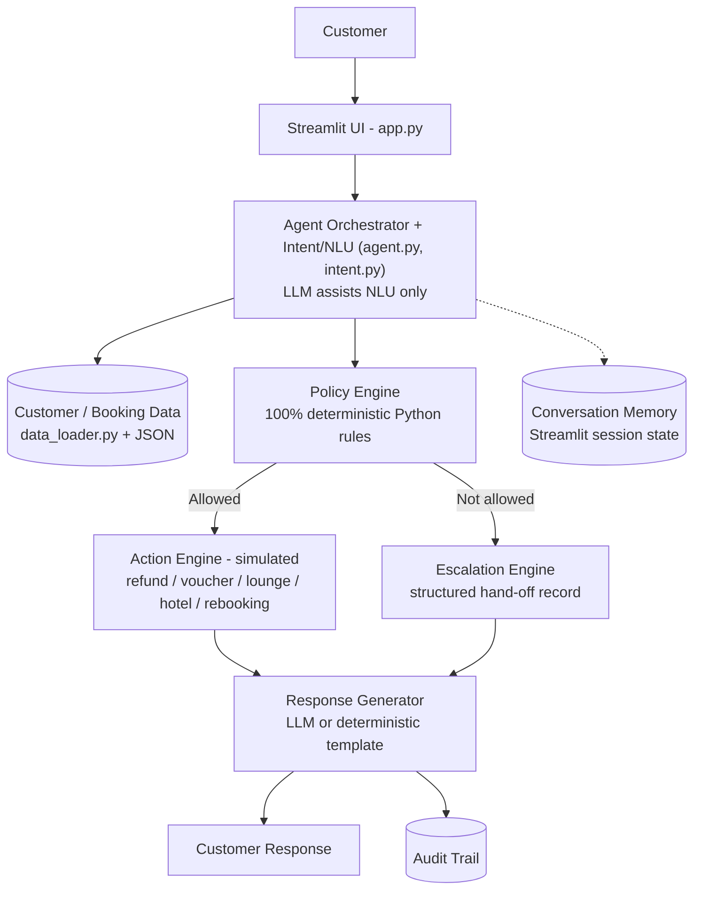

# ✈️ AirResolve AI — Customer-Facing Airline Resolution Agent

An agentic AI prototype that behaves like a real airline customer-support resolution agent:
it identifies the customer, retrieves their booking, applies deterministic airline policy,
takes (simulated) action or escalates to a human, and keeps a full audit trail — all
grounded strictly in a supplied data pack, with no invented policies or facts.

Built for a 6-hour agentic-AI college/industry assignment.

---

## 1. Project Overview

AirResolve AI is a Streamlit application that simulates an AI-powered airline
customer resolution desk. A customer (played by the evaluator) chats with the
agent about a cancelled or delayed flight. The agent:

- Understands what the customer is asking and how they feel (NLU)
- Identifies the customer and their booking from what they say
- Retrieves the customer's real (supplied) booking/flight data
- Runs the request through a **deterministic Python policy engine**
- Either executes an allowed action (simulated) or escalates to a human agent
- Explains *why* it did what it did (policy used, reason, eligibility)
- Logs everything to a structured, inspectable audit trail

## 2. Problem Statement

Airline disruptions (cancellations, delays) generate huge support volume.
Human agents spend most of their time doing the same three things: looking
up a booking, checking what policy applies, and explaining it calmly to a
frustrated customer. Mistakes happen when agents either under-deliver
(missing an entitlement) or over-promise (inventing compensation they
aren't authorized to give). AirResolve AI automates the repeatable,
rules-based part of this job while keeping humans in the loop for anything
outside its authority.

## 3. Objectives

1. Resolve airline-caused disruption requests correctly and consistently.
2. Never invent policy, compensation, or facts not in the supplied data.
3. Always defer to a human for out-of-authority requests (upgrades, large
   fare waivers, legal threats, formal complaints, non-standard refunds).
4. Make every decision explainable and auditable.
5. Be genuinely interactive and demo-ready in 15 minutes.

## 4. Architecture

Rendered as a Mermaid flowchart below:



**Key design principle (grounded + safe-by-construction):** the LLM is used only
for (a) assisting with intent/sentiment extraction and (b) phrasing the final
reply. It **never** decides eligibility, compensation, or escalation — that is
100% deterministic Python in `policy_engine.py`. This is enforced structurally:
the policy engine functions take no LLM input at all.

## 5. Technology Stack

- **Python 3.10+**
- **Streamlit** — UI / session state / chat
- **Anthropic API** (`anthropic` SDK) — optional LLM for NLU-assist + response phrasing
- **Pandas** — available for any tabular work (lightweight use here)
- **JSON** — grounded customer / booking / policy data
- Pure Python rule-based policy, action, and escalation engines
- `python-dotenv` for environment variable loading

The app runs fully in **mock mode** with zero API key — every policy decision,
action, and escalation works identically; only the phrasing of replies falls
back to deterministic templates instead of LLM-generated prose.

## 6. Project Structure

```
airresolve-ai/
├── app.py                    # Streamlit UI
├── requirements.txt
├── README.md
├── .env.example
├── .gitignore
├── PPT_CONTENT.md
├── DEMO_SCRIPT.md
├── .streamlit/config.toml    # dark theme
├── data/
│   ├── customers.json        # source-of-truth customer profiles
│   ├── bookings.json         # source-of-truth flight/booking data
│   └── policies.json         # source-of-truth policy rules
├── agent/
│   ├── agent.py              # orchestrator + optional LLM client
│   ├── intent.py             # rule-based (+ optional LLM) NLU
│   ├── policy_engine.py      # deterministic decisions (the source of truth)
│   ├── action_engine.py      # simulated action execution
│   ├── escalation.py         # structured escalation records
│   └── prompts.py            # LLM system prompts (NLU + response generation)
└── utils/
    ├── data_loader.py        # loads/looks up JSON data
    ├── audit_logger.py       # structured timestamped audit trail
    └── helpers.py            # sentiment/entity extraction, ID generators
```

## 7. How the Agent Works

For every customer message:

1. **Intent Detection** (`agent/intent.py`) — a keyword-based detector always
   runs and finds every matching intent category (`CANCELLATION`, `REFUND`,
   `HOTEL`, `UPGRADE`, `LEGAL_THREAT`, etc.) plus a sentiment
   (`calm` / `confused` / `frustrated` / `angry`, tone-only, never a diagnosis).
   If an API key is configured, an LLM pass can *add* extra recognised
   intents, but can never remove or override the rule-based ones.
2. **Identification** — the agent tries to recognise the customer from PNR,
   name, or flight number already in the message; if the conversation
   already has an identified customer, it's reused (conversation memory).
   If nobody can be identified, the agent asks exactly one necessary
   question for a name or PNR.
3. **Retrieval** — the customer's real booking + flight record is pulled
   from `data/*.json` (never invented).
4. **Policy Engine** (`agent/policy_engine.py`) — deterministic functions
   decide eligibility, the allowed action(s), the reason, and whether
   escalation is required.
5. **Action or Escalation** — eligible, allowed actions are executed
   (simulated) via `action_engine.py`; anything requiring authority the
   agent doesn't have is escalated via `escalation.py`, producing a
   structured escalation record (ID, customer, PNR, request, policy
   constraint, reason, status).
6. **Response Generation** — an LLM (if configured) or a deterministic
   template turns the decision(s) into a natural, concise, empathetic
   reply — strictly grounded in the JSON decision objects it's given.
7. **Audit Trail** — every identification, retrieval, policy match, action,
   and escalation is appended to a timestamped, inspectable log.

## 8. Policy Engine (grounded rules)

| Rule | Summary |
|---|---|
| **Cancellation Rebooking** | Airline-caused cancellation → customer chooses free rebooking within 24h OR full refund. |
| **Delay Compensation** | ≤3h: meal voucher. >3h: + lounge access. >5h: + hotel for the delayed hours only (never a full night). |
| **Refund** | Full refund, within 7 business days, original payment method only. |
| **Fare Difference** | Voluntary upgrade to a pricier flight → customer pays the difference; agent can waive up to ₹1,500 only. |
| **Loyalty Tier** | Gold/Platinum → priority rebooking only, **never** extra compensation. |

## 9. Escalation Logic

The agent escalates immediately, with no attempt to resolve itself, when:

- Compensation is requested beyond stated policy
- A fare-difference waiver above ₹1,500 is requested
- An exception is requested for a **non-airline-caused** disruption
- The customer threatens **legal action**
- The customer says they will file a **formal complaint**
- A refund is requested to a **different payment method**
- Any other request needs authority the supplied policy doesn't grant (e.g. free upgrades)

Each escalation produces a record with: Escalation ID, Customer, PNR,
Requested Action, Policy Constraint, Reason, Timestamp, Status — visible
live in the UI's Escalations panel.

## 10. Three Demo Scenarios

| # | Customer | Situation | Expected outcome |
|---|---|---|---|
| 1 | Priya Nair (Gold, SK4821X) | SK-204 Delhi→Goa cancelled; then demands cash refund + free business-class upgrade "for the trouble" | Refund processed; upgrade **escalated** (no policy authority) |
| 2 | Arvind Kulkarni (Silver, TR1190B) | SK-118 delayed 4h; asks for a hotel | Meal voucher + lounge access granted; hotel **denied** (delay ≤ 5h) with reason shown |
| 3 | Meher Kaur (Platinum, WL7742) | SK-305 delayed 6h; wants a full night's hotel, then wants to switch to a flight ₹2,000 pricier, waived | Meal + lounge + hotel (delayed hours only, not full night) granted; ₹2,000 waiver **escalated** (exceeds ₹1,500 authority) |

Load any of these instantly from the sidebar's **Demo Scenarios** buttons.

## 11. Setup Instructions

```bash
git clone <this-repo>
cd airresolve-ai
python -m venv .venv
source .venv/bin/activate   # Windows: .venv\Scripts\activate
pip install -r requirements.txt
cp .env.example .env        # optional -- add your ANTHROPIC_API_KEY to enable LLM phrasing
```

## 12. Environment Variables

| Variable | Required? | Purpose |
|---|---|---|
| `ANTHROPIC_API_KEY` | No | Enables LLM-assisted NLU + natural response phrasing. Without it, the app runs in **mock mode** with deterministic templates — all policy logic is identical. |
| `ANTHROPIC_MODEL` | No | Overrides the default model (`claude-sonnet-5`). |

## 13. How to Run

```bash
streamlit run app.py
```

Then open the local URL Streamlit prints (typically `http://localhost:8501`).

## 14. Example Conversations

> **Customer:** My flight SK-204 was cancelled.
> **Agent:** I've confirmed that flight SK-204 (Delhi → Goa) was cancelled due
> to operational reasons. Under our cancellation policy you can either rebook
> on the next available flight within 24 hours at no charge, or request a
> full refund. Which would you prefer?

> **Customer:** I'm furious. I want a full cash refund and a free business-class
> upgrade on my return flight for the trouble.
> **Agent:** I understand how frustrating this is. I've processed your full
> refund (Ref REF-SK4821X), due within 7 business days to your original
> payment method. There's no policy provision for a complimentary upgrade,
> including for Gold-tier customers, so I'm escalating that part to a
> supervisor (ESC-1001).

## 15. Limitations

- Prototype only: all actions (refunds, vouchers, hotel bookings) are **simulated**; nothing touches a real airline, payment, or hotel system.
- Only the three supplied customers/bookings/policies are known; anything outside that data pack is explicitly declared out-of-scope rather than guessed.
- Intent/sentiment detection is keyword-based by default (with optional LLM assist) — not a full NLU model; unusual phrasing may be misclassified.
- Single-process, in-memory session state — no persistent database or multi-user backend.

## 16. Future Improvements

- Real backend integrations (PNR systems, payment gateway, hotel/voucher APIs)
- A proper NLU/classification model with confidence scores and human-in-the-loop review for low-confidence intents
- Multi-turn slot-filling for partially specified requests
- Role-based supervisor dashboard to actually action the escalation queue
- Persistent storage (database) for audit trail and case history across sessions
- Multi-language support

## 17. AI Tools Used in Building This Project

This project was built with the help of the following AI tools:

- **Claude** (Anthropic) — architecture design, agent/policy-engine logic, and documentation
- **Codex / GPT** (OpenAI) — code generation assistance and debugging support

All AI-generated code and content were reviewed, tested, and adapted by the author before inclusion in the final project.